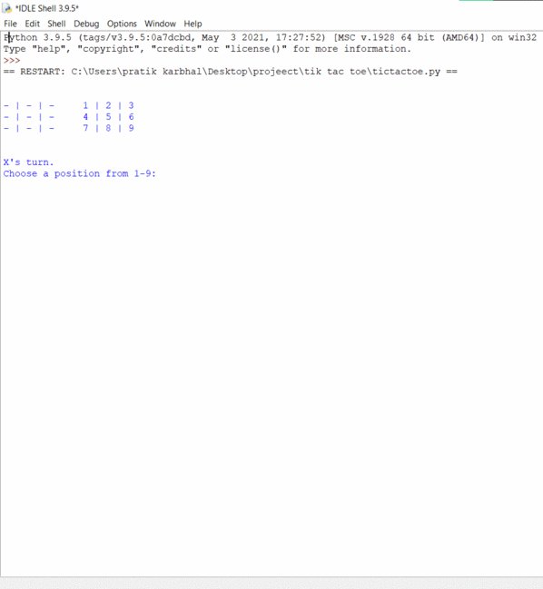

# a-simple-tic-tac-toe-game (Python based).

Flow: Design scoreboard> Store information using data structures> Handle player input> Update information> Check win or draw> Switch the current player> Game Loop>> Complete Working Code

# Results

